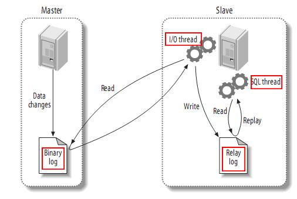

fdemo
=====

Fdemo is a mysql binlog parser written in c++, support mysql5.6 or later.

### Note:

  

mysql5.6以后引入了并行复制的概念，但是也是基于库的复制。mysql5.7加入了更细粒度的复制(前提是要对binlog进行改动的),根据commit_id来对binlog进行更细粒度的并发执行。但是在目前的生产环境中大多使用的还是5.6或者之前的版本，所以就需要对mysql原有的slave复制策略进行改进。关于并行复制，网上有很多文章进行说明，比较有代表性的就是阿里的同学[这篇文章](http://dinglin.iteye.com/blog/2272079),里面有很详细的说明，这里就不再叙述，下面主要说明下binlog并发复制策略相关的问题，在不修改binlog 的前提下的SQL线程3种分发策略:
- 基于库的分发策略
- 基于表的分发策略
- 基于行的分发策略  

fdemo实现了后两种分发策略，具体代码在src/binlogevent下。

### Promble:

1. 一开始只实现了按表分发复制，但是测试的时候发现，如果大部分的写操作都是对于同一张表的话，  
   这时候就失去了并行复制的意义了，所以增加了按行复制，来解决热点表问题。
2. 按行复制的时候，有一点要注意,要保证事务的原子性(尤其是从库有读的情况),对于大的事务，  
   用于决策的不是一行，而是多行。但是还是有个问题，就是会导致master和slave的binlog顺序不一  
   致，5.7给出了解决方案，通过参数slave_preserve_commit_order=1来保证，如果不保证的话可能  
   会有一些问题(主从切换和gtid等),可以参照[这里](http://dev.mysql.com/doc/refman/5.7/en/replication-features-transaction-inconsistencies.html)的描述。

### Usage:
```
1. 进入fdemo主目录，执行make，生成对应的二进制文件
2. 配置相应的参数，执行二进制文件,这时候就开始从master拉取binlog了
3. 具体的执行情况可以通过日志来查看
```

### 改进和问题反馈：
    现在只是解析了binlog，然后按照相应的策略进行分发，还没有真正去执行后续打算做这个
    1. 邮件：demon1991yl@gmail.com
